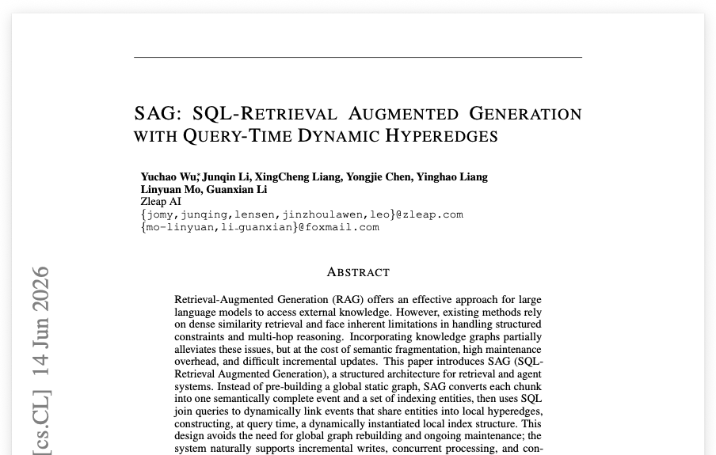
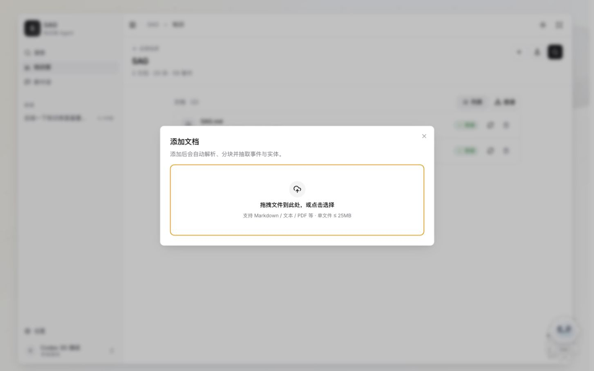
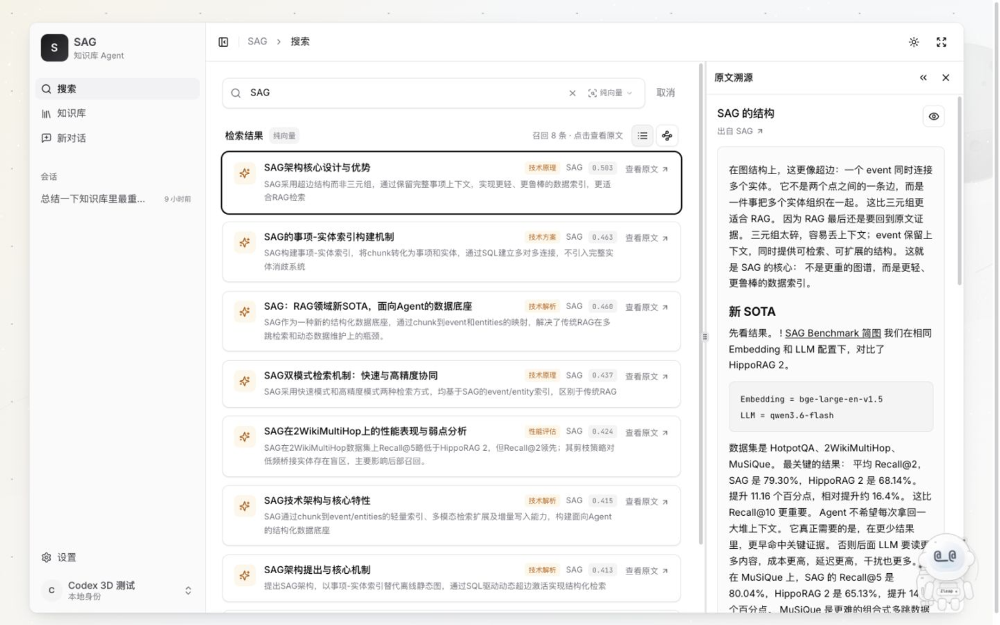
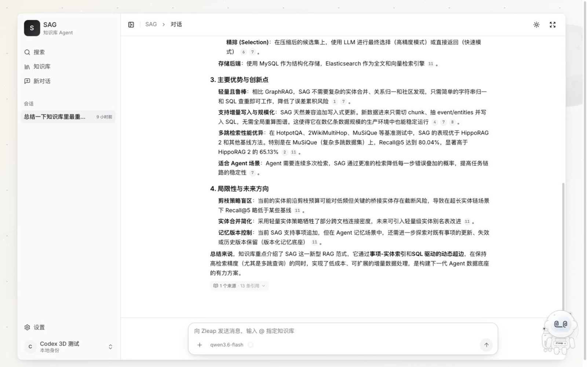
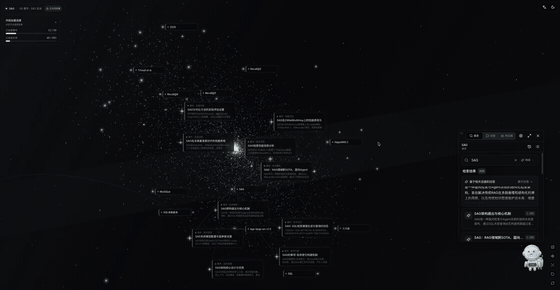
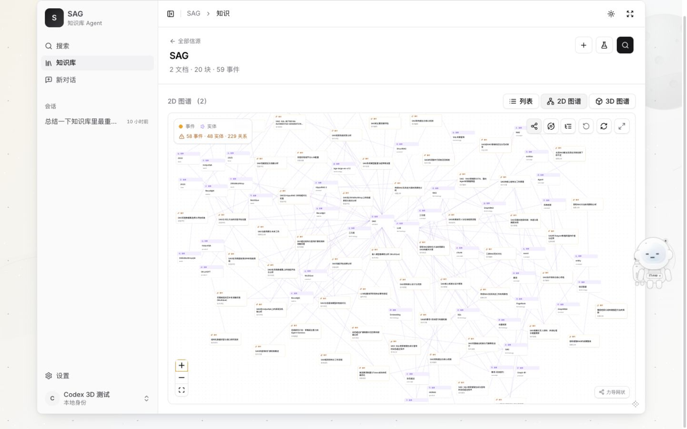
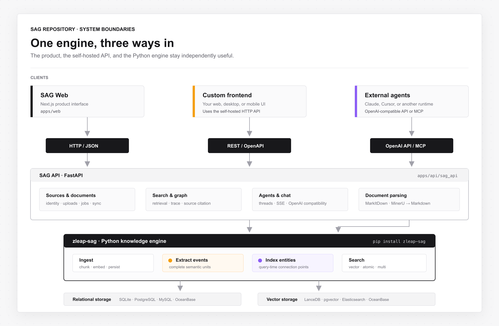

<p align="center">
  
</p>

<h1 align="center">saga</h1>

<p align="center">
  <a href="README.md">English</a> · <a href="README.zh.md">简体中文</a> · <strong>繁體中文</strong>
</p>

<p align="center">
  <a href="https://arxiv.org/abs/2606.15971"></a>
  <a href="https://pypi.org/project/zleap-sag/"></a>
  
  <a href="https://github.com/Zleap-AI/SAG/releases/latest"></a>
  
  
  <a href="LICENSE"></a>
</p>

<p align="center"><strong>從現在起，這是你唯一需要的知識庫應用程式。</strong></p>

<p align="center">
  基於最先進的 SAG 架構，將分散的文件與資料轉化為可搜尋、相互關聯且可溯源的知識。
</p>

https://github.com/user-attachments/assets/9bb618e9-fef8-4d07-8a30-3f7d83beb0ff

## 目錄

<p align="center">
  <a href="#community">社群</a> ·
  <a href="#project">專案</a> ·
  <a href="#technology">技術</a> ·
  <a href="#user-guide">使用指南</a> ·
  <a href="#developer-guide">開發指南</a>
</p>

---

<a id="project"></a>

## 專案

### 更新日誌

**2026 年 7 月 14 日**

發布基於 `zleap-sag` 套件全新打造的版本，介面全面重新設計。舊版已封存於 `v1` 分支，不再維護。

### SAG 一分鐘速覽

SAG 並非傳統 RAG 與 GraphRAG 的融合，而是一套取而代之的原創檢索架構。

透過事件–實體索引與查詢時動態超邊，SAG 在同一系統中同時實現語意檢索與關聯推理，無需維護兩套 RAG 系統或合併兩條檢索路徑。

在 HotpotQA、2WikiMultiHopQA 和 MuSiQue 三個資料集共 9 項 Recall@1/2/5 指標中，SAG 在其中 8 項奪得最佳成績，創下 RAG 新的最高水準。

本專案是基於 SAG 構建的完整知識庫應用程式，適用於個人使用者與 Agent：

**來源與文件 → 結構化知識 → 搜尋與溯源 → 帶引用的 Agent 回答 → 透過 API 或 MCP 復用**

只需上傳一次文件，SAG 便會自動完成解析、切塊、嵌入、事件與實體抽取，並確保每筆檢索結果都能追溯至原始文字。之後即可跨來源搜尋、檢視事件–實體圖、進行帶引用的問答，或將同一份知識開放給其他應用程式使用。

| 功能 | 說明 |
| --- | --- |
| 知識匯入 | 支援檔案與網路來源、文件解析、切塊、嵌入、事件／實體抽取、背景處理 |
| 搜尋 | 全域或限定來源的檢索，提供快速模式（`vector`）與精確模式（`multi`）|
| 溯源 | 可從任一結果或引用直接開啟對應的原始切塊 |
| 知識圖譜 | 檢視事件、實體及其可查詢的關聯關係 |
| Agent 對話 | 基於所選知識來源的多輪回答，附帶可點擊的引用 |
| 整合 | 自託管 REST/OpenAPI、OpenAI 相容對話介面、MCP，以及 `zleap-sag` Python 套件 |

本產品刻意採用本地優先、單使用者設計。預設使用 SQLite 與 LanceDB，無需外部資料庫，並提供清晰的遷移路徑至 PostgreSQL/pgvector 及其他正式後端。

---

<a id="technology"></a>

## 技術

### 論文

**SAG: SQL-Retrieval Augmented Generation with Query-Time Dynamic Hyperedges**<br>
Yuchao Wu, Junqin Li, XingCheng Liang, Yongjie Chen, Yinghao Liang, Linyuan Mo, and Guanxian Li

[閱讀論文](https://arxiv.org/abs/2606.15971) · [重現基準測試](https://github.com/Zleap-AI/SAG-Benchmark)

<p align="center">
  <a href="https://arxiv.org/abs/2606.15971">
    
  </a>
</p>

### 原創第三架構

傳統密集 RAG 主要透過語意相似度來檢索切塊。GraphRAG 在此之上加入離線圖構建，但代價是三元組抽取、實體合併、關係正規化、全域維護，以及困難的增量更新。

SAG 並不封裝這兩套系統，而是以自身的資料模型與執行路徑取而代之：

```text
切塊 → 一個語意完整的事件
切塊 → 多個索引實體
事件 ↔ 實體 → 一條潛在超邊
```

- **事件** 承載切塊的完整語意，不被拆解為獨立的三元組。
- **實體** 是輕量級的索引與擴展點，而非事件語意的替代品。
- **查詢時動態超邊** 在 SQL 將共享實體的事件圍繞當前查詢進行聯接時，於本地臨時生成。SAG 不預先建立或全域維護這些超邊。
- **原始證據** 始終是輸出邊界。所選事件總能對映回來源切塊，用於生成與引用。

SAG 內部的語意路徑與結構路徑是 SAG 管線的原生組成部分，而非傳統 RAG 服務與 GraphRAG 服務的並行運行。

<p align="center">
  
</p>

### 檢索流程

**離線索引**

1. 將文件解析為語意連貫的切塊。
2. 從每個切塊中平行抽取一個事件與多個實體。
3. 將切塊、事件、實體及事件–實體關聯持久化至關聯式儲存。
4. 將切塊、事件與實體的表示向量持久化至向量／全文索引。

**線上檢索**

1. 利用語意與詞彙訊號找出種子實體與事件。
2. 透過 SQL 聯接共享實體，從種子事件擴展至本地候選空間。
3. 僅實例化與當前查詢相關的超邊，無需全域圖遍歷或重建。
4. 選取最強的事件與直接切塊候選，去重後返回原始證據切塊。

這使得增量寫入成為自然操作：新切塊只需加入自身的事件、實體與關聯，而無需重新計算全域圖。

### RAG 最新最高水準

在相同的 `BGE-Large-EN-v1.5` 嵌入與 `Qwen3.6-Flash` LLM 配置下，SAG 在 HotpotQA、2WikiMultiHopQA 和 MuSiQue **共 9 項 Recall@1/2/5 指標中的 8 項**取得最佳成績。其平均 Recall@2/Recall@5 為 **79.30%/88.18%**，而 HippoRAG 2 為 **68.14%/83.28%**。

完整結果：

| 資料集 | 方法 | Recall@1 | Recall@2 | Recall@5 |
| --- | --- | ---: | ---: | ---: |
| HotpotQA | **SAG** | **47.80%** | **91.55%** | **96.50%** |
| HotpotQA | HippoRAG 2 | 44.40% | 78.35% | 94.35% |
| 2WikiMultiHopQA | **SAG** | **43.53%** | **82.30%** | 88.00% |
| 2WikiMultiHopQA | HippoRAG 2 | 42.38% | 76.55% | **90.35%** |
| MuSiQue | **SAG** | **36.17%** | **64.05%** | **80.04%** |
| MuSiQue | HippoRAG 2 | 30.65% | 49.52% | 65.13% |
| **平均** | **SAG** | **42.50%** | **79.30%** | **88.18%** |
| **平均** | HippoRAG 2 | 39.14% | 68.14% | 83.28% |

完整方法與重現腳本請參閱[論文](https://arxiv.org/abs/2606.15971)與 [SAG-Benchmark](https://github.com/Zleap-AI/SAG-Benchmark)。

---

<a id="user-guide"></a>

## 使用指南

### 桌面應用程式（最簡便）

從 [GitHub Releases](https://github.com/Zleap-AI/SAG/releases/latest) 下載最新桌面安裝程式：

| 平台 | 下載 | 更新行為 |
| --- | --- | --- |
| macOS 15+，Apple Silicon | `SAG-*-mac-arm64.dmg` | 已簽署、公證，透過穩定頻道自動更新 |
| Windows 10/11，x64 | `SAG-Setup-*-win-x64.exe` | 目前尚未簽署，Windows 可能顯示未知發行者警告；仍支援穩定自動更新 |

桌面應用程式內建 Web 工作區與本地知識後端，使用者無需安裝 Python、Node.js 或資料庫。應用程式更新會保留作業系統應用資料目錄中的知識庫與上傳檔案。發行校驗碼以 `SHA256SUMS.txt` 形式公布。

### 快速啟動（Docker，自託管）

需求：Docker Desktop，或具備 Compose v2 的 Docker Engine。

```bash
git clone https://github.com/Zleap-AI/SAG.git
cd SAG
docker compose up -d --build
```

啟動應用程式無需 API 金鑰、Python 執行環境、Node 執行環境或外部資料庫。兩個服務健康後，開啟以下網址：

- Web 應用程式：[http://localhost:3000](http://localhost:3000)
- API 文件：[http://localhost:8000/docs](http://localhost:8000/docs)

首次啟動：

1. 輸入你的名字以建立或還原本地身份。
2. 使用 302.AI 快速設定，或開啟**設定 → 模型**，配置任何 OpenAI 相容的 LLM 與嵌入端點。
3. 建立來源、上傳文件，並等待其狀態變為**就緒**。
4. 進行搜尋、開啟原始來源，或開始帶引用的對話。

沒有模型憑證也能啟動介面與服務。索引／向量檢索需要嵌入模型；事件抽取、查詢理解與生成回答則需要 LLM。

### 匯入知識

建立來源並新增 Markdown、純文字、PDF、Office 或其他支援格式的文件。SAG 會將文件正規化為 Markdown，然後在背景進行切塊、嵌入、事件抽取與實體抽取。

<p align="center">
  
</p>

PDF 檔案在已設定 MinerU 時優先使用它，無法使用或失敗時退回本地 MarkItDown。其他 Office 與文字格式預設使用 MarkItDown。

### 搜尋並驗證來源

全域搜尋或將查詢限定於特定來源。每筆結果都可在排名結果旁開啟原始切塊，便於在 Agent 使用前檢查檢索品質。

<p align="center">
  
</p>

### 帶引用的問答

預設 Agent 會搜尋綁定的知識來源、串流回答，並附上可點擊的引用。同一對話路徑也可透過 OpenAI 相容端點使用。

<p align="center">
  
</p>

### 探索模式

探索模式將整個知識庫展開為互動式知識宇宙。可搜尋事件與實體、穿越其關聯關係，並在同一視圖中開啟事件詳情或原始來源。

<p align="center">
  
</p>

### 探索事件–實體圖

將來源從列表檢視切換至圖譜檢視，即可檢查 SAG 索引所產生的事件、實體與關聯。

<p align="center">
  
</p>

<p align="center">
  
</p>

### MCP 指南

#### 作為 Agent Skill 使用（Claude Code、Codex 等）

SAG 在 [`skills/sag/`](skills/sag/) 提供官方 Skill，教導 Agent 使用八種唯讀 MCP 工具：先呼叫 `list_sources` 確認可存取範圍，再依照 `list_documents → outline → search/grep → get_chunk/read` 探索漏斗定位並引用知識。

將目錄複製至你的 Agent skills 目錄：

```bash
# Claude Code
cp -R skills/sag ~/.claude/skills/sag-knowledge

# Codex
cp -R skills/sag ~/.codex/skills/sag-knowledge
```

#### 直接在 Agent 中掛載 MCP

Skill 為選用。在 SAG 中開啟**設定 → 整合 → Knowledge MCP**，選擇 HTTP 或本地指令並複製完整設定。複製的 HTTP 設定包含目前的 JWT、預設開放所有來源，並可用 `source_id` 限定範圍。

<p align="center">
  
</p>

### 將 SAG 作為模型使用（OpenAI 相容）

SAG 提供 OpenAI Chat Completions 端點，具備與內建對話相同的檢索與引用行為：

```bash
curl -s http://localhost:8000/api/v1/openai/<AGENT_ID>/chat/completions \
  -H "Authorization: Bearer <SAG_JWT>" \
  -H "Content-Type: application/json" \
  -d '{"messages":[{"role":"user","content":"這份資料的主要內容是什麼？"}]}'
```

回應為標準 `chat.completion` 格式，附加 `sag.citations` 欄位；標準用戶端會忽略未知欄位。設定 `"stream": true` 可接收 SSE 串流。

### 操作與更新

```bash
docker compose ps                  # api 與 web 應顯示為 healthy
docker compose logs -f api web     # 追蹤日誌
docker compose restart             # 重啟服務
docker compose down                # 停止並保留所有資料

git pull --ff-only                 # 更新原始碼
docker compose up -d --build       # 重建（不刪除資料卷）
```

預設持久化方式：

| 執行環境 | 應用程式元資料 | 知識引擎 | 位置 |
| --- | --- | --- | --- |
| Docker 預設 | SQLite | SQLite + LanceDB | Docker volume `sagdata` |
| 本地開發 | SQLite | SQLite + LanceDB | `apps/api/.data/` |
| PostgreSQL 覆蓋 | PostgreSQL | PostgreSQL + pgvector | `pgdata` 與 `sagdata` volumes |

`docker compose down` 會保留資料。**`docker compose down -v` 將永久刪除資料庫、知識索引與已上傳的檔案。**

### 網路與正式部署安全

預設 Compose 設定將 port 3000 與 8000 綁定至 `127.0.0.1`。SAG 目前為本地單使用者產品，請勿將這些 port 直接暴露於公共網路。

如需自訂 port 或信任的區域網路位址：

```bash
cp .env.example .env
# 編輯 BIND_ADDRESS、WEB_PORT、API_PORT、SAG_CORS_ORIGINS 與 NEXT_PUBLIC_API_BASE
docker compose up -d --build
```

`NEXT_PUBLIC_API_BASE` 在建置期間編譯至 Web 映像，變更後需加上 `--build` 重新建置。伺服器部署應加入 HTTPS 及外部存取控制層，例如 VPN、IP 允許清單或反向代理身份驗證。

---

<a id="developer-guide"></a>

## 開發指南

### 系統邊界

SAG 採用前後端分離架構，Next.js 前端與 FastAPI 後端各自獨立。後端是基於公開的 `zleap-sag` Python 引擎構建的參考應用程式。你可以在自己的前端中復用完整的後端，或在自有的 Python 服務中直接嵌入 `zleap-sag`。

<p align="center">
  
</p>

### 倉庫結構

```text
apps/
├── web/                    Next.js 15 + React 19 產品介面
├── desktop/                Electron shell、打包與本地執行週期管理
└── api/
    ├── sag_api/
    │   ├── api/v1/         FastAPI HTTP 路由與序列化
    │   ├── connectors/     檔案／網路來源連接器與登錄表
    │   ├── parsing/        MarkItDown 與 MinerU 正規化
    │   ├── jobs/           背景匯入 → 抽取狀態機
    │   ├── sag/            唯一匯入 zleap-sag 的應用程式介面卡
    │   ├── generation/     已檢索證據 → 串流帶引用回答
    │   ├── mcp/            Knowledge MCP 伺服器與 HTTP 掛載
    │   ├── services/       應用程式／領域編排
    │   └── tools/          內建與遠端 MCP Agent 工具
    └── sag_agent/          與框架無關的 Agent 執行核心
skills/sag/                 透過 MCP 探索 SAG 的 Agent Skill
deploy/                     部署初始化資產
docs/assets/readme/         README 截圖與架構圖
```

核心依賴規則很簡單：應用程式程式碼透過 `apps/api/sag_api/sag/` 存取引擎；引擎本身不感知 FastAPI、Web 介面、使用者、對話或引用。

### 本地開發

在倉庫根目錄下，分別在兩個終端啟動後端與前端。

```bash
# 終端 1：API，位於 http://localhost:8000
cd apps/api
python -m venv .venv
. .venv/bin/activate
pip install -e ".[dev]"
cp .env.example .env
uvicorn sag_api.main:app --reload
```

```bash
# 終端 2：Web，位於 http://localhost:3000
cd apps/web
npm install
npm run dev
```

實用指令：

```bash
cd apps/api && pytest
cd apps/api && ruff check .
cd apps/web && npm run typecheck
cd apps/web && npm run build
```

### 桌面用戶端

Electron 用戶端將相同的 Next.js 應用程式與本地 FastAPI 後端打包在一起。桌面開發、特定平台發布建置、簽署、更新設定與資料位置等詳情請參閱 [`apps/desktop/README.md`](apps/desktop/README.md)。

### 直接使用 `zleap-sag`

[`zleap-sag`](https://pypi.org/project/zleap-sag/) 是支撐 SAG 應用程式的持續維護 Python 引擎。發行名稱：`zleap-sag`；匯入路徑：`zleap.sag`；Python：3.11+；授權：MIT。本應用程式目前需要 `zleap-sag>=0.7.1`。

安裝零基礎設施本地堆疊：

```bash
pip install zleap-sag
```

然後執行完整的匯入 → 抽取 → 搜尋生命週期：

```python
import asyncio

from zleap.sag import DataEngine, EngineConfig
from zleap.sag.config import EmbeddingConfig, LLMConfig


async def main() -> None:
    config = EngineConfig(
        llm=LLMConfig(
            api_key="sk-...",
            base_url="https://your-openai-compatible-host/v1",
            model="qwen3.6-flash",
        ),
        # 省略 api_key/base_url 時，嵌入會復用 LLM 端點。
        embedding=EmbeddingConfig(model="bge-large-en-v1.5"),
        language="zh",
    )

    # 一個 DataEngine 實例代表一個邏輯資料來源。
    async with DataEngine(config) as engine:
        ingest = await engine.ingest("knowledge.md")
        extract = await engine.extract()
        result = await engine.search(
            "SAG 為何對多跳檢索有效？",
            strategy="multi",
            top_k=5,
        )

        print(ingest.chunk_count, extract.event_count)
        for section in result.sections:
            print(section.get("content", "")[:200])


asyncio.run(main())
```

本地儲存會自動建立於 `./.zleap/` 下。請將該目錄加入 `.gitignore`。

#### 設定

使用其中一種設定方式，勿混用：

| 方式 | 建構方式 | 適用場景 |
| --- | --- | --- |
| 參數注入 | `EngineConfig(llm=..., embedding=...)` | 函式庫、筆記本、明確的應用程式接線 |
| 環境變數 | `EngineConfig.from_env()` 或 `from_env(env_file=".env")` | 容器與 12-factor 服務 |

最簡環境變數設定：

```bash
export OPENAI_API_KEY=sk-...
export OPENAI_BASE_URL=https://your-openai-compatible-host/v1
export LLM_MODEL=qwen3.6-flash
export EMBEDDING_MODEL=bge-large-en-v1.5
```

```python
from zleap.sag import EngineConfig

config = EngineConfig.from_env()
```

`EngineConfig(...)` 不會隱式讀取環境變數，請使用明確參數或 `from_env()`。可透過 `EmbeddingConfig(api_key=..., base_url=..., model=...)` 設定獨立的嵌入端點。

#### `DataEngine` 公開 API

| API | 用途 |
| --- | --- |
| `await engine.start()` | 初始化連接；本地 SQLite/LanceDB schema 自動建立 |
| `await engine.aclose()` | 關閉引擎資源；使用 `async with` 時自動處理 |
| `await engine.chunk(source)` | 解析並切塊路徑或原始字串，不進行持久化 |
| `await engine.ingest(path, ...)` | 解析一份文件，切塊、嵌入，並持久化切塊／向量 |
| `await engine.extract(...)` | 為當前來源抽取並持久化事件–實體索引 |
| `await engine.search(query, strategy=..., top_k=...)` | 返回含 `sections` 及計時／統計資訊的型別化 `SearchResult` |
| `await engine.init_schema()` | 冪等初始化正式 schema；預設本地堆疊不需要 |

型別化結果可從 `zleap.sag.results` 取得：`ChunkResult`、`IngestResult`、`ExtractResult` 與 `SearchResult`。所有引擎例外均繼承自 `SagError`，應用程式邊界可捕獲同一基底型別。

#### 檢索模式

| 介面標籤 | Python strategy | 實作方式 |
| --- | --- | --- |
| 快速（預設） | `vector` | 依語意相似度直接檢索，回應更快 |
| 精確 | `multi` | 結合實體關係與 LLM 重排序，結果更完整 |

介面僅提供**快速**與**精確**兩種檢索模式。精確模式對應 SAG 的 `multi` strategy，並非獨立運行 GraphRAG。

#### 儲存後端

| 部署方式 | 關聯式儲存 | 向量儲存 | 套件額外依賴 |
| --- | --- | --- | --- |
| 本地預設 | SQLite | LanceDB | 無 |
| 單一資料庫 | PostgreSQL | pgvector | `zleap-sag[postgres]` |
| 正式分離 | MySQL/PostgreSQL/OceanBase | Elasticsearch | `zleap-sag[mysql]`、`[postgres]`、`[es]` |
| 單一資料庫 | OceanBase 4.3.3+ | OceanBase vector | `zleap-sag[mysql]` |

變更 `EngineConfig` 即可切換後端，無需修改匯入／抽取／搜尋呼叫。目前引擎連接為程序全域，每個程序請使用一個 `EngineConfig`。

完整套件設定、額外依賴、範例與更新日誌請參閱 [`zleap-sag` 套件頁面](https://pypi.org/project/zleap-sag/)。

### 以 SAG 後端構建自訂前端

瀏覽器無法直接匯入 Python 套件。自訂前端應呼叫擁有 `DataEngine` 的 Python HTTP 服務。本倉庫的 FastAPI 後端即為該參考服務，且已與 Next.js 介面分離。

啟動 SAG 後即可使用自託管 API：

| 入口 | 位址 |
| --- | --- |
| API 基底 | `http://localhost:8000/api/v1` |
| 互動式 OpenAPI | [http://localhost:8000/docs](http://localhost:8000/docs) |
| OpenAPI schema | [http://localhost:8000/openapi.json](http://localhost:8000/openapi.json) |
| MCP Streamable HTTP | `http://localhost:8000/mcp/` |

這是**自託管 API**，並非託管的公有雲 API。大多數路由需要 SAG JWT：

```bash
curl -s http://localhost:8000/api/v1/auth/login \
  -H 'Content-Type: application/json' \
  -d '{"name":"Developer"}'
```

從回應中複製 `access_token`，以下列方式傳送：

```http
Authorization: Bearer <SAG_TOKEN>
```

#### API 總覽

| 領域 | 主要路由 | 用途 |
| --- | --- | --- |
| 系統 | `GET /system/health`、`/system/ready`、`/system/capabilities` | 健康狀態與引擎能力 |
| 身份 | `POST /auth/login`、`GET /auth/me` | 本地身份與 JWT |
| 來源 | `GET/POST /sources`、`GET/PATCH/DELETE /sources/{id}` | 來源生命週期 |
| 文件 | `/sources/{id}/documents` 與 `/documents/ingest` | 檔案上傳、持續文字／訊息匯入、重新處理、刪除 |
| 搜尋 | `POST /search`、`POST /sources/{id}/search` | 全域或限定來源的 `vector`／`multi` 檢索 |
| 圖譜 | `GET /sources/{id}/entities`、`/sources/{id}/graph` | 事件–實體檢視 |
| Agent | `/agents`、`/threads`、`/ask` | Agent 設定、對話、SSE 執行、引用 |
| OpenAI 相容 | `POST /openai/{agent_id}/chat/completions` | 將任意 SAG Agent 作為帶引用的模型使用，支援串流與非串流 |
| MCP | `/mcp/` 或 `/mcp/?source_id={id}` | 向 MCP 主機開放整個知識庫或單一來源 |

建立來源、匯入文字並搜尋：

```bash
BASE=http://localhost:8000/api/v1
TOKEN=<SAG_TOKEN>

SOURCE_ID=$(curl -s -X POST "$BASE/sources" \
  -H "Authorization: Bearer $TOKEN" \
  -H 'Content-Type: application/json' \
  -d '{"name":"產品文件"}' | jq -r .id)

curl -s -X POST "$BASE/sources/$SOURCE_ID/documents/ingest" \
  -H "Authorization: Bearer $TOKEN" \
  -H 'Content-Type: application/json' \
  -d '{"title":"SAG","text":"SAG 使用事件–實體索引與查詢時動態超邊。"}'

curl -s -X POST "$BASE/sources/$SOURCE_ID/search" \
  -H "Authorization: Bearer $TOKEN" \
  -H 'Content-Type: application/json' \
  -d '{"query":"SAG 如何檢索知識？","strategy":"multi","top_k":5}'
```

文件匯入由背景工作佇列處理。在查詢搜尋結果前，請先確認文件狀態或其工作已完成。

若前端來自其他 origin，請將其加入 `SAG_CORS_ORIGINS`。若 API 位址有所變更，請以對應的 `NEXT_PUBLIC_API_BASE` 重新建置 Web 映像。

### PostgreSQL/pgvector 部署

選用的正式部署覆蓋設定可將應用程式元資料與引擎儲存遷移至 PostgreSQL/pgvector：

```bash
cp .env.example .env
openssl rand -hex 32   # 設定 SAG_SECRET_KEY
openssl rand -hex 24   # 設定 POSTGRES_PASSWORD

docker compose -f compose.yaml -f compose.postgres.yaml config
docker compose -f compose.yaml -f compose.postgres.yaml up -d --build
```

伺服器部署前請設定正確的 `SAG_CORS_ORIGINS` 與 `NEXT_PUBLIC_API_BASE`。升級前請備份 `pgdata` 與 `sagdata`。

---

## 貢獻與授權

- 貢獻流程：[CONTRIBUTING.md](CONTRIBUTING.md)
- Python 引擎：[PyPI 上的 `zleap-sag`](https://pypi.org/project/zleap-sag/)
- 論文重現：[Zleap-AI/SAG-Benchmark](https://github.com/Zleap-AI/SAG-Benchmark)

SAG 依 [MIT 授權條款](LICENSE)發布。

---

<a id="community"></a>

## 社群

歡迎加入 SAG Discord 或微信社群，與維護者及其他使用者交流。

<table align="center">
  <tr>
    <th>Discord</th>
    <th>微信</th>
  </tr>
  <tr>
    <td align="center"></td>
    <td align="center"></td>
  </tr>
</table>
